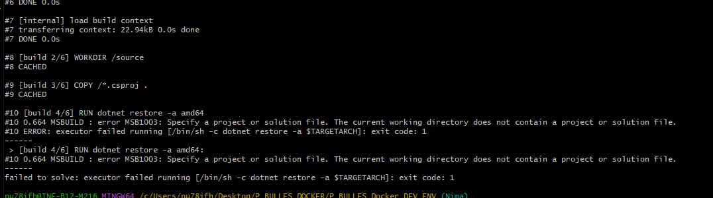

# Dockeriser un environnement complet: rapport de travail

P_Bulles - Nima Zarrabi - CID2A


## 1. Reseignement

J’ai d’abord commencé par le renseigner sur docker et la dockerisation de plusieurs services en même temps.
J’ai découvert que tout ce faisait dans un fichier docker-compose.yaml.
J’ai ensuite trouver des exemples de ce genre de fichier afin de les analyser, en voici un exemple :

```
version: "3.7"
services:
  backend:
    build:
      context: backend
      target: development
    secrets:
      - db-password
    depends_on:
      - db
  db:
    image: mariadb
    restart: always
    healthcheck:
      test: [ "CMD", "mysqladmin", "ping", "-h", "127.0.0.1", "--silent" ]
      interval: 3s
      retries: 5
      start_period: 30s
    secrets:
      - db-password
    volumes:
      - db-data:/var/lib/mysql
    environment:
      - MYSQL_DATABASE=example
      - MYSQL_ROOT_PASSWORD_FILE=/run/secrets/db-password
    expose:
      - 3306
  proxy:
    build: proxy
    ports:
      - 8080:80
    depends_on:
      - backend
volumes:
  db-data:
secrets:
  db-password:
    file: db/password.txt
```

cet example est disponible depuis https://github.com/dockersamples/compose-dev-env

afin de tester, j'ai pull le repertoire GitHub de l'exemple sur ma machine, puis j'ai lacer la commande "docker-compose up -d" dans le git bash.


J’ai pu donc tester l’environnement, qui fonctionne très bien.
J'ai fermer l'environnement avec un simple docker-compose down, puis j’ai testé cet environnement trouver sur https://github.com/docker/awesome-compose/tree/master/nginx-aspnet-mysql
Cet environnement m’a paru plus intéressant car il dockerise un serveur ASP.NET ainsi qu’une base de donnée MySQL, ce qui sont des services nécessaire pour mon projet.

voici le docker-compose.yaml de base:

```
services:
  backend:
    build:
      context: backend
    restart: always
    secrets:
      - db-password
    depends_on:
      db:
        condition: service_healthy
    environment:
      - ASPNETCORE_URLS=http://+:8000

  db:
    # We use a mariadb image which supports both amd64 & arm64 architecture
    image: mariadb:10-focal
    # If you really want to use MySQL, uncomment the following line
    #image: mysql:8
    command: '--default-authentication-plugin=mysql_native_password'
    restart: always
    healthcheck:
      test: ['CMD-SHELL', 'mysqladmin ping -h 127.0.0.1 --password="$$(cat /run/secrets/db-password)" --silent']
      interval: 3s
      retries: 5
      start_period: 30s
    secrets:
      - db-password
    volumes:
      - db-data:/var/lib/mysql
    environment:
      - MYSQL_DATABASE=example
      - MYSQL_ROOT_PASSWORD_FILE=/run/secrets/db-password

  proxy:
    build: proxy
    ports:
      - 80:80
    depends_on:
      - backend

volumes:
  db-data:

secrets:
  db-password:
    file: db/password.txt
```

## 2. Analyse

J'ai essayé d'analyser ce fichier, mais je me suis rendu compte qu'il serais plus simple de commencer par le premier exemple, voici donc mon analyse de ce premier fichier:

```
services:
# New container "db" for mariadb database
  db:
    image: mariadb:latest                                 # Set image to latest from mariadb
    restart: always                                       # Docker will always attempt to restart the container if it exits
    secrets:
      - db-password                                       # Set db-password to be a secret
    environment:
      MYSQL_DATABASE: test_database                       # Set database name
      MYSQL_ROOT_PASSWORD: /run/secrets/db-password       # Set the password that will be used for the root account as db-password, which is in the "secrets" list
      MYSQL_USER: nims                                    # Set database user name
      MYSQL_PASSWORD: pswnims                             # Set database password
    ports:
      - "3306:3306"                                       # Set the ports
    volumes:
      - db-data:/var/lib/mysql                            # Set path for storing database data

# New container "phpmyadmin" for phpmyadmin connection
  phpmyadmin:
    image: phpmyadmin:5.2.0                               # Set image to phpmyadmin
    restart: always                                       # Docker will always attempt to restart the container if it exits
    environment:
      PMA_ARBITRARY: 1
      PMA_PORT: 3306
      PMA_HOST: db                                        # host must be "db" because the database host container name is "db"
      PMA_USER: nims                                      # Database user must be the same as db MYSQL_USER
      PMA_PASSWORD: pswnims                               # Database password must be the same as db MYSQL_PASSWORD
    ports:
      - "8080:80"                                         # Set the ports
    depends_on:
      - db                                                # Sets dependentrices; phpmyadmin requires the "db" container to run

# Volume creation and secrets added
volumes:
  db-data:                                                # Create volume "db-data" for persistant storage
secrets:
  db-password:
    file: db/secret_password.txt                          # Set db-password to be text in the password file
```

durant mes tests, j'ai us de nombreux problème, mais celui que m'a pris le plus de temps était lié au volume:
ces environnement peuvent partire aussi rapidement qu'ils sont lancer, mais les images et volumes reste!
après avoir crée une base de donnée, j'ai changer le mot de passe et nom d'utilisateur de la base de donnée et de phpmyadmin, dans le docker-compose.yaml, je pensait que la connexion fonctionnerais toujours tant que ces information d'authentification sont les mêmes dans les deux services.
mais en réalité, MySQL n'a pas changer ses information de connexion car il se basais sur le volume "db-data", qui lui n'a pas changer.
j'ai finallement compris mon erreur, et j'ai supprimer le volume, qui s'est recrée au prochain docker-compose up, mais cette fois-ci, avec les informations du docker-compose.yaml mis à jour, mySQL a finalement accépté mes information d'autenthification.

## dockerisation d'une application ASP.NET

j'ai a présent décidé de dockeriser une application ASP.NET, dans un context dev.
Après quelque recherches, j'ai trouvé [ce guide sur learn.microsoft](https://learn.microsoft.com/fr-fr/aspnet/core/host-and-deploy/docker/building-net-docker-images?view=aspnetcore-8.0)

je l'ai suivie mais j'ai us de nombreux problèmes, souvent liée à la version de .NET SDK, qui n'était pas assez haute.
après avoir mis à jour .NET SDK en 8.0.204

problem ici



problem : Pages de l'aspnetapp copier dans l'image, il faudrais les stocker quelque part d'autre

## Sources:

```
[Image de couverture](https://spacelift.io/blog/docker-secrets)

[Setup et exemple de compose-dev](https://docs.docker.com/desktop/dev-environments/set-up/)
[Lien au GitHub comprenant les fichiers de Docker Docs](https://github.com/dockersamples/compose-dev-env)
[Commentaire dockerfile](https://betterstack.com/community/questions/how-do-i-make-a-comment-in-dockerfile/)
[Explication docker-compose.yaml vs compose.yaml](https://stackoverflow.com/questions/76751032/why-should-you-call-the-docker-compose-file-compose-yaml-instead-of-docker-co#:~:text=The%20main%20difference%20is%20that,backwards%20compatibility%20of%20earlier%20versions)

[Aide pour les commandes docker-compose](https://gist.github.com/mkfares/41c9609fcde8d9f665210034e99d4bd9)
[Aide syntaxe dockerfile](https://docs.docker.com/compose/compose-file/build/)
[Explication entre les différents paramètres « restart » du docker-compose](https://ioflood.com/blog/docker-compose-restart-command-guide-with-examples/#:~:text=always%3A%20As%20the%20name%20implies,retry%20attempts%20under%20this%20policy)
[Aide aux commandes de volumes Docker](https://docs.docker.com/storage/volumes/)
[Reference pour dockerfile](https://docs.docker.com/reference/dockerfile/)
[Example de yaml pour une connexion entre container mariadb et phpmyadmin](https://mytchall.dev/running-mysql-and-phpmyadmin-locally-in-docker/)
[Aide pour la dockerisation phpmyadmin](https://hub.docker.com/_/phpmyadmin)
[Aide pour les options du container phpmyadmin](https://hub.docker.com/_/phpmyadmin)
[Aide pour les network entre container](https://docs.docker.com/compose/networking/)
[Reference pour le container de tests db](https://github.com/schmunk42/docker-mariadb-example-databases/tree/master)
```
